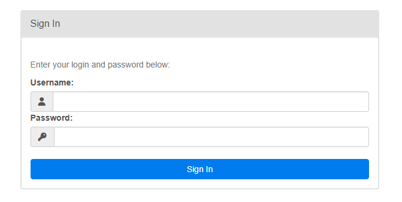
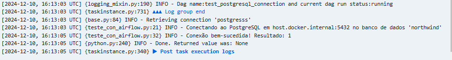

# Pipeline para Análise: ETL com Airflow, Python e Visualização no Power BI 

## 1. Introdução

**Objetivo do Projeto:** Extrair e transformar dados de uma API de comércio eletrônico, disponibilizada pela FakeStoreAPI, utilizando Python e a biblioteca Requests. Apesar de a FakeStoreAPI conter dados fictícios, ela é uma excelente ferramenta para compreender conceitos fundamentais de projetos de dados, especialmente envolvendo orquestração e processos ETL. O objetivo final é realizar a análise desses dados, integrando-os a uma solução de visualização (Power BI).

**Contexto:** Este projeto foi desenvolvido para demonstrar como criar uma solução orquestrada de extração, transformação e carregamento (ETL) utilizando Docker, Airflow e PostgreSQL. Os dados extraídos da API FakeStore são transformados no momento da extração, armazenados no banco de dados PostgreSQL e posteriormente utilizados para criar dashboards no Power BI.

## 2. Escopo do Projeto
**Incluído:**   
- Configuração de um ambiente Docker com Airflow e conexão com PostgreSQL local, incluindo a instalação e configuração adequadas para garantir a comunicação entre os serviços.
- Extração, transformação e armazenamento de dados da API FakeStore.
- Integração com Power BI para criação de dashboards.

**Excluído:**
- Desenvolvimento de modelos preditivos ou análises estatísticas complexas.
- Integração com outras APIs ou sistemas.

## 3. Fontes de Dados
**Descrição dos Dados:**
- Origem: FakeStoreAPI (https://fakestoreapi.com/).
- Estrutura: Dados de produtos, usuários e pedidos em formato JSON.
- Qualidade dos Dados: Os dados estruturados e prontos para uso exigiram transformações para desnormalização. Essas transformações incluíram a reorganização dos dados de forma que cada conjunto de produtos relacionados fosse separado, especialmente no caso de carrinhos, com o objetivo de garantir que cada produto pudesse ser analisado individualmente e em seu contexto.
Além disso, outras transformações também foram realizadas como: Renomeação de colunas para nomes mais intuitivos e conversão de formatos de data. 

## 4. Metodologia
**Ferramentas Utilizadas:**
- Linguagem: Python
- Bibliotecas: Todas que foram utilizadas já vêm pré-instaladas no contêiner Docker.
- Orquestração: Apache Airflow
- Banco de Dados: PostgreSQL
- Visualização: Power BI

**Etapas do Processo:**
- Configurações e Conexão Necessárias: Todas as etapas estão detalhadas em <a href="#tutorial">Tutorial</a> <br>

## 5. Resultados

## 6. Conclusões e Recomendações

## Tutorial: Como instalar e configurar o Apache Airflow com Docker <a name="tutorial"></a>
Contexto: 
- Airflow tem várias dependências (banco de dados, executores, webserver, scheduler). Configurá-las manualmente pode ser complexo. Com o Docker, essas dependências são gerenciadas em contêineres, facilitando a configuração.  
- O Docker cria um ambiente isolado, garantindo que o Airflow funcione sem interferências de outros softwares instalados no sistema.  
- Configurações baseadas em Docker (via Docker Compose, por exemplo) podem ser facilmente compartilhadas entre equipes, garantindo que todos utilizem o mesmo ambiente, independentemente do sistema operacional.  
- O Airflow depende de várias bibliotecas que não têm suporte completo ou não funcionam adequadamente no Windows. Ele foi originalmente projetado para ambientes baseados em Linux/Unix, onde a maioria das suas dependências opera de forma nativa.

### 1. Instalação do Docker:

1.1 Instale o Docker  
Certifique-se de que o Docker está instalado em seu sistema. Você pode baixá-lo e instalá-lo a partir do site oficial: [Docker](https://www.docker.com/).

1.2 Usuários de Windows -> Configure o WSL  
Se você está utilizando o Windows, será necessário instalar e configurar o Windows Subsystem for Linux (WSL). Atualize o WSL utilizando o seguinte comando no terminal:
```bash
wsl --update
```
1.3 Testando o Docker: Após a instalação, teste se o Docker está funcionando corretamente executando no PowerShell:
```bash 
docker --version
```

Se o comando rodar com sucesso, o Docker está pronto para uso.


### 2. Instalação do Airflow:

2.1 Acesse o Site Oficial do Airflow: Entre no site oficial do [Airflow.](https://airflow.apache.org/)

2.2 Localize a Seção de Instalação: Clique em **Install Airflow** no menu do site. Selecione a versão desejada (no projeto, foi utilizada a versão 2.10.2).

2.3 Encontre as Instruções para Docker: Use a barra de pesquisa na documentação e procure por **docker**. Clique no resultado **Running Airflow in Docker**.

2.4 Obtenha o Arquivo docker-compose.yaml: Na página, localize a seção Fetching docker-compose.yaml. Clique no link para o arquivo docker-compose.yaml e faça o download para a pasta do seu projeto. Ou copie o conteúdo do arquivo e cole em um novo arquivo chamado docker-compose.yml dentro da pasta do projeto.

2.6 Estrutura de Diretórios: 
Crie as seguintes pastas no seu diretório de trabalho para configurar corretamente o ambiente:
- /dags - Pasta onde você armazenará seus DAGs (pipelines de dados).  
- /logs - Pasta onde os logs de execução serão salvos.  
- /plugins - Local para seus plugins personalizados.  

É importante criar as pastas manualmente para garantir controle sobre as permissões e evitar problemas de sincronização entre o host e o contêiner. A pasta config é opcional e pode ser usada caso você queira adicionar configurações personalizadas

**AVISO: Dependendo do seu sistema operacional, pode ser necessário configurar o Docker para usar pelo menos 4,00 GB de memória para que os contêineres do Airflow funcionem corretamente.**

- **Usuários Windows:** Para alterar o uso de memória alocada para o Docker, abra um editor de texto e digite as configurações desejadas:
```bash
[wsl2]
memory=4GB
```
- Salve o arquivo como .wslconfig no diretório do seu usuário: C:\usarios\user.
- No campo Nome do arquivo, insira 
.wslconfig.
- No campo Tipo, escolha Todos os Arquivos.
- Clique em Salvar
- Abra o Prompt de Comando ou o PowerShell e execute:
```bash
wsl --shutdown
```
- Abra o terminal do WSL e digite o comando:
```bash
free -h
```
- O resultado será algo como:
```bash
        total    used   free
Mem:    4.0G     1.2G   1.8G
Swap:   1.0G     0.3G   0.7G
```
- total: Memória total alocada ao WSL.
- used: Memória sendo usada.
- free: Memória disponível.

O Comando abaixo também pode confirmar a quantidade de memória alocada para o Docker:
```bash
docker info
```

2.7 Inicialize o ambiente do Airflow: 
Com o Docker aberto, abra o terminal bash na pasta onde está o arquivo docker-compose.yml e execute o comando:

```bash 
docker compose up airflow-init
```
Aguarde enquanto o Airflow instala as dependências e configurações necessárias.

2.8 Confirmação de Inicialização: 
Quando o processo for concluído, você verá uma mensagem como esta: 

```bash airflow-init_1       | Upgrades done
airflow-init_1       | Admin user airflow created
airflow-init_1       | 2.10.2
start_airflow-init_1 exited with code 0
```
2.9 Inicie os serviços do Airflow: Para iniciar o Airflow, digite: 

```bash 
docker compose up -d
```
O parâmetro -d executa os contêineres em segundo plano, sem travar o terminal.

2.10 Você pode confirmar o estado dos contêineres com o seguinte comando:
 ```bash 
docker ps
```
Caso algum contêiner esteja apresentando falha, você pode acessar o terminal dentro contêiner do Airflow:

Isso permite inspecionar o ambiente diretamente:

 ```bash 
docker exec -it <container_name> bash
```
**Obs.:** A memória RAM é um fator importante para o desempenho dos contêineres Docker, especialmente durante a inicialização e a transição para o estado "healthy". No meu computador, o tempo necessário para que todos os contêineres fossem iniciados completamente foi de 20 minutos.

2.11 Acesse o Airflow: Aguarde a inicialização dos contêineres. Acesse o Airflow no navegador em: http://localhost:8080. Isso redirecionará para a tela de login do Airflow.



O usuário e senha padrão do Airflow são ambos **airflow.**

### 3 . Configurando o PostgreSQL no Airflow:

3.1 Acesse a interface do Airflow.

3.2 Abra o menu de conexões: Vá em Admin > Connections.

3.3 Adicione uma nova conexão: lique no botão + Add a new record.

3.4 Configure a conexão: Preencha os campos conforme abaixo:
- Host (obrigatório): O host ao qual se conectar.
- Database (opcional): Especifique o nome do banco de dados ao qual se conectar.
- Login (obrigatório): Especifique o nome de usuário para conexão.
- Senha (obrigatória): Especifique a senha para conexão.

**Para que o Airflow em um contêiner Docker possa acessar seu banco de dados PostgreSQL local, você precisa configurar adequadamente a rede para que o contêiner do Docker possa se comunicar com a máquina host:**
 - O contêiner do Docker precisa do endereço IP da máquina host para se conectar ao PostgreSQL. Você pode usar **host.docker.internal** (em sistemas Windows/Mac) ou descobrir manualmente o IP no Linux.
 


**Configurar o PostgreSQL para aceitar conexões externas:**
- No Windows, os arquivos de configuração do PostgreSQL geralmente estão no diretório de instalação, como: C:\Program Files\PostgreSQL\<versao>\data
- Abra o arquivo postgresql.conf e procure pela linha listen_addresses. Por padrão, o PostgreSQL aceita conexões apenas de localhost. Para permitir conexões externas, altere: **listen_addresses = '*'**
- Abra o arquivo pg_hba.conf e adicione a seguinte linha: 

 ```bash 
host  all   all   0.0.0.0/0  md5
```

3.5 Testando a configuração ao PostgrePostgreSQL:  
Para verificar se a conexão foi configurada corretamente, acesse o contêiner do Airflow:

 ```bash 
docker exec -it <container_name> bash
```
Verifique a conexão configurada: Utilize o comando airflow connections get para verificar os detalhes da conexão: 

 ```bash
airflow connections get <Connection Id>
```
Substitua Connection Id pelo nome que você definiu para a conexão.  

Se o comando exibiu corretamente os detalhes da conexão, incluindo senha, login, e os demais campos configurados, isso indica que a conexão foi configurada corretamente no Airflow.


3.6 Testando a conexão com o Banco de Dados: 

Na pasta dags do seu projeto, crie um arquivo .py que conterá o código para testar a conexão com o PostgreSQL.

Acesse o contêiner do Airflow:

 ```bash 
docker exec -it <container_name> bash
```
Após acessar o contêiner, verifique se os arquivos de DAG foram corretamente copiados ou montados, executando o seguinte comando:

 ```bash 
ls /opt/airflow/dags
```
Este comando exibirá a lista de arquivos presentes na pasta dags dentro do contêiner.

Depois de confirmar que as DAGs estão sendo mapeadas corretamente, acesse a interface do Airflow (Airflow UI) e execute a DAG responsável por testar a conexão do Airflow com o banco de dados. O resultado do teste será exibido diretamente na interface da DAG ou nos logs da execução:



Posteriormente, já será possível realizar a criação e o carregamento dos dados no banco de dados. Para isso, basta configurar as DAGs responsáveis pelas tarefas de criação das tabelas e pelo processo de ETL (Extração, Transformação e Carga) para inserir os dados no banco. Essas DAGs podem ser acionadas diretamente na interface do Airflow, garantindo que os dados sejam processados e carregados corretamente

Autor:
Leticia da Luz

[](https://www.linkedin.com/in/leticiadluz/)

